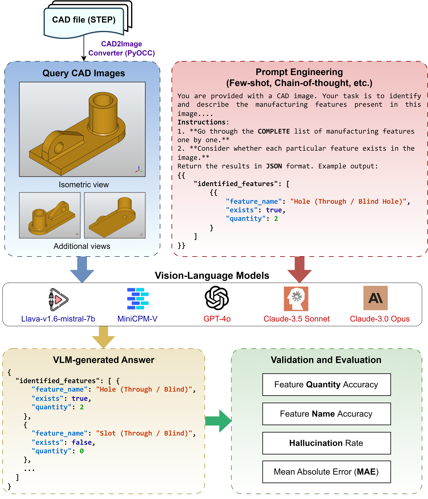
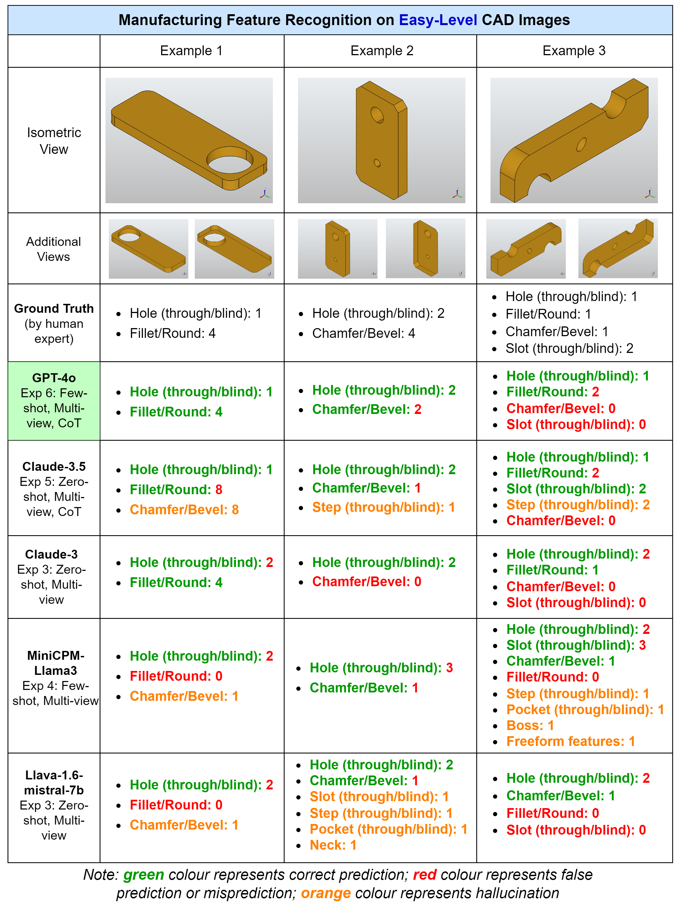
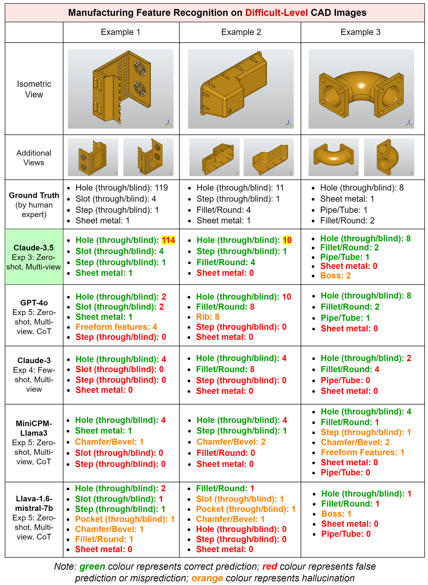

# VLM-CADFeatureRecognition

This repository contains the code and resources accompanying the paper "[Leveraging Vision-Language Models for Manufacturing Feature Recognition in CAD Designs](https://arxiv.org/abs/2411.02810)". The study explores the application of vision-language models (VLMs) to automate the recognition of various manufacturing features in CAD designs without extensive training datasets or predefined rules.

## Overview

Automatic Feature Recognition (AFR) is crucial for converting design knowledge into actionable manufacturing information. Traditional AFR methods often rely on predefined geometric rules and large datasets, which can be time-consuming and may lack generalizability across different manufacturing features. This project investigates the use of VLMs, employing prompt engineering techniques such as multi-view query images, few-shot learning, sequential reasoning, and chain-of-thought, to recognize a wide range of manufacturing features in CAD designs.


<p align="center">
  
  <br>
  <em>Figure 1: Overview of VLM-based AFR approach</em>
</p>

<!-- <p align="center">
  
  <br>
  <em>Figure 2: Few-shot learning for VLM-driven AFR</em>
</p>

<p align="center">
  
  <br>
  <em>Figure 3: MFCAD-VLM dataset for CAD feature recognition</em>
</p>

<p align="center">
  
  <br>
  <em>Figure 4: Example of an easy CAD feature recognition task</em>
</p>

<p align="center">
  
  <br>
  <em>Figure 5: Example of a complex CAD feature recognition task</em>
</p> -->

## MFCAD-VLM Dataset

The study utilizes the [MFCAD-VLM dataset](https://zenodo.org/record/14038050), a comprehensive collection designed to advance research in CAD and AFR. The dataset includes:

- **STEP Files**: CAD models in STEP format, representing various parts with distinct manufacturing features, categorized by complexity levels (easy, medium, and hard).
- **Ground Truth JSON Files**: Expert-annotated JSON files corresponding to each STEP file, detailing manufacturing feature types, quantities, and specifics essential for accurate AFR assessment.
- **Multi-View Isometric Images**: Three isometric-view snapshots per CAD model, generated via Python, capturing different viewing angles to aid feature recognition tasks.


## Installation

To set up the environment, follow these steps:

1. **Clone the repository**:

   ```bash
   git clone https://github.com/Davidlequnchen/VLM-CADFeatureRecognition.git
   cd VLM-CADFeatureRecognition
   ```

2. **Install the required Python libraries**:

   Ensure you have Python installed, then run:

   ```bash
   pip install -r requirements.txt
   ```

## Usage

1. **Download the MFCAD-VLM Dataset**:

   Access and download the dataset from [Zenodo](https://zenodo.org/record/14038050). Extract the contents to a directory of your choice.

2. **Configure the Dataset Path**:

   In the project's configuration file or script, set the path to the directory where the MFCAD-VLM dataset is located.

3. **Run Experiments**:

   Execute the provided scripts to perform feature recognition tasks as described in the paper. For example:

   ```bash
   python run_experiment.py --config configs/experiment_config.yaml
   ```

   Replace `configs/experiment_config.yaml` with the path to your specific configuration file.

## Citation

If you find this repository or the MFCAD-VLM dataset useful in your research, please cite the following paper:

```bibtex
@article{khan2024leveraging,
  title={Leveraging Vision-Language Models for Manufacturing Feature Recognition in CAD Designs},
  author={Khan, Muhammad Tayyab and Chen, Lequn and Ng, Ye Han and Feng, Wenhe and Tan, Nicholas Yew Jin and Moon, Seung Ki},
  journal={arXiv preprint arXiv:2411.02810},
  year={2024}
}
```

## License

This project is licensed under the MIT License. See the [LICENSE](LICENSE) file for details.

## Acknowledgements

We acknowledge the support from the Singapore Institute of Manufacturing Technology (SIMTech), the Advanced Remanufacturing and Technology Centre (ARTC), and Nanyang Technological University (NTU).